# Diaken - Diagramas de Flujo del Sistema

## 📋 Índice
1. [Deploy VM - Flujo Completo](#deploy-vm---flujo-completo)
2. [Execute Playbook on Host - Flujo Manual](#execute-playbook-on-host---flujo-manual)
3. [Execute Playbook on Group - Flujo Manual](#execute-playbook-on-group---flujo-manual)
4. [Scheduled Playbook Execution - Flujo Programado](#scheduled-playbook-execution---flujo-programado)
5. [Snapshot Lifecycle - Creación y Limpieza](#snapshot-lifecycle---creación-y-limpieza)

---

## 1. Deploy VM - Flujo Completo


### Resultado del Deploy:
- ✅ VM creada y configurada en vCenter
- ✅ Host registrado en inventario (active=True)
- ✅ Entrada en /etc/hosts
- ✅ Sistema operativo configurado
- ✅ Historial guardado en BD

---

## 2. Execute Playbook on Host - Flujo Manual

```mermaid
flowchart TD
    Start([Usuario: Execute Playbook]) --> SelectEnv[Seleccionar Environment]
    SelectEnv --> FilterGroups[Filtrar Groups<br/>por Environment]
    
    FilterGroups --> SelectGroup[Seleccionar Group<br/>opcional]
    SelectGroup --> FilterHosts[Filtrar Hosts<br/>por Group]
    
    FilterHosts --> SelectHost[Seleccionar Host]
    SelectHost --> SelectPlaybook[Seleccionar Playbook]
    
    SelectPlaybook --> SnapshotCheck{Crear snapshot?}
    
    SnapshotCheck -->|No| BuildInventory[Construir inventory<br/>Ansible]
    SnapshotCheck -->|Yes| CheckVCenter{Host tiene<br/>vCenter?}
    
    CheckVCenter -->|No| SnapshotWarn[Warning: No vCenter]
    CheckVCenter -->|Yes| GetVCenterCred[Obtener credenciales<br/>vCenter]
    
    SnapshotWarn --> BuildInventory
    GetVCenterCred --> ConnectVC[Conectar a vCenter]
    
    ConnectVC --> FindVM[Buscar VM por IP]
    FindVM --> CreateSnap[Crear Snapshot:<br/>'Before executing {playbook}<br/>- {timestamp}']
    
    CreateSnap --> SnapResult{Resultado}
    SnapResult -->|Error| SnapError[Log error<br/>continuar]
    SnapResult -->|Success| SnapSuccess[Log success]
    
    SnapError --> BuildInventory
    SnapSuccess --> BuildInventory
    
    BuildInventory --> InventoryContent[Inventory contiene:<br/>- ansible_host=IP<br/>- ansible_user<br/>- ansible_ssh_key<br/>- python_interpreter]
    
    InventoryContent --> GetGlobalVars[Obtener Global Settings<br/>como extra_vars]
    GetGlobalVars --> RunPlaybook[Ejecutar ansible-playbook<br/>con inventory]
    
    RunPlaybook --> AnsibleExec[Ansible ejecuta tareas<br/>en el host remoto]
    AnsibleExec --> CaptureOutput[Capturar stdout/stderr]
    
    CaptureOutput --> ParseResult{Analizar resultado}
    
    ParseResult -->|failed>0| Failed[Ejecución FALLIDA]
    ParseResult -->|unreachable>0| Failed
    ParseResult -->|returncode!=0| Failed
    ParseResult -->|Success| Success[Ejecución EXITOSA]
    
    Failed --> SaveHistoryFail[Guardar en<br/>DeploymentHistory<br/>status=failed]
    Success --> SaveHistorySuccess[Guardar en<br/>DeploymentHistory<br/>status=success]
    
    SaveHistoryFail --> ShowResult[Mostrar resultado<br/>al usuario]
    SaveHistorySuccess --> ShowResult
    
    ShowResult --> End([Fin])
    
    style Start fill:#90EE90
    style Success fill:#90EE90
    style Failed fill:#FFB6C1
    style CreateSnap fill:#87CEEB
    style SnapSuccess fill:#87CEEB
```

### Resultado de Execute Playbook on Host:
- ✅ Snapshot creado (si se solicitó)
- ✅ Playbook ejecutado en el host
- ✅ Output capturado
- ✅ Historial guardado
- ✅ Usuario ve resultado en tiempo real

---

## 3. Execute Playbook on Group - Flujo Manual

```mermaid
flowchart TD
    Start([Usuario: Execute on Group]) --> SelectEnv[Seleccionar Environment]
    SelectEnv --> FilterGroups[Filtrar Groups<br/>por Environment]
    
    FilterGroups --> SelectGroup[Seleccionar Group]
    SelectGroup --> SelectPlaybook[Seleccionar Playbook]
    
    SelectPlaybook --> SnapshotCheck{Crear snapshots?}
    
    SnapshotCheck -->|No| GetHosts[Obtener hosts activos<br/>del grupo]
    SnapshotCheck -->|Yes| GetHostsSnap[Obtener hosts activos<br/>del grupo]
    
    GetHostsSnap --> LoopSnap[Para cada host<br/>con vCenter]
    LoopSnap --> CreateSnap[Crear Snapshot]
    CreateSnap --> NextHost{Más hosts?}
    NextHost -->|Yes| LoopSnap
    NextHost -->|No| GetHosts
    
    GetHosts --> ValidateHosts{Hosts > 0?}
    ValidateHosts -->|No| NoHosts[Error: No hosts<br/>en el grupo]
    ValidateHosts -->|Yes| BuildGroupInv[Construir inventory<br/>con todos los hosts]
    
    NoHosts --> End([Fin con error])
    
    BuildGroupInv --> GroupVars[Agregar group_vars:<br/>- group_name<br/>- target_environment]
    
    GroupVars --> GetGlobalVars[Obtener Global Settings]
    GetGlobalVars --> RunPlaybook[Ejecutar ansible-playbook<br/>en grupo]
    
    RunPlaybook --> AnsibleExec[Ansible ejecuta en<br/>TODOS los hosts<br/>en paralelo]
    
    AnsibleExec --> CaptureOutput[Capturar output<br/>de todos los hosts]
    
    CaptureOutput --> ParseResults{Analizar resultados}
    
    ParseResults -->|Algún failed| PartialFail[Ejecución PARCIAL]
    ParseResults -->|Todos success| AllSuccess[Ejecución EXITOSA]
    ParseResults -->|Todos failed| AllFailed[Ejecución FALLIDA]
    
    PartialFail --> SaveHistory[Guardar historial<br/>con detalles por host]
    AllSuccess --> SaveHistory
    AllFailed --> SaveHistory
    
    SaveHistory --> ShowResults[Mostrar resultados:<br/>- Total hosts<br/>- Exitosos<br/>- Fallidos<br/>- Output por host]
    
    ShowResults --> EndSuccess([Fin])
    
    style Start fill:#90EE90
    style AllSuccess fill:#90EE90
    style AllFailed fill:#FFB6C1
    style PartialFail fill:#FFD700
    style CreateSnap fill:#87CEEB
```



### Resultado de Execute Playbook on Group:
- ✅ Snapshots creados para todos los hosts (si se solicitó)
- ✅ Playbook ejecutado en paralelo en todos los hosts
- ✅ Output individual por host
- ✅ Resumen de éxitos/fallos
- ✅ Historial detallado guardado

---

## 4. Scheduled Playbook Execution - Flujo Programado

```mermaid
flowchart TD
    Start([Usuario: Schedule Task]) --> Form[Formulario de programación]
    Form --> Input[Ingresar datos:<br/>- Task name<br/>- Environment<br/>- Group/Host<br/>- Playbook<br/>- Date/Time<br/>- Create snapshot?]
    
    Input --> Submit[Submit]
    Submit --> Validate{Validar}
    
    Validate -->|Error| ShowError[Mostrar error]
    ShowError --> Form
    
    Validate -->|OK| ParseDateTime[Parsear fecha/hora<br/>a timezone local]
    ParseDateTime --> CheckFuture{Fecha futura?}
    
    CheckFuture -->|No| ShowError
    CheckFuture -->|Yes| CreateTask[Crear ScheduledTask:<br/>- status=pending<br/>- create_snapshot<br/>- scheduled_datetime]
    
    CreateTask --> SaveDB[Guardar en BD]
    SaveDB --> ShowSuccess[Mostrar confirmación]
    ShowSuccess --> WaitExec[Esperar ejecución...]
    
    WaitExec --> CronCheck[Cron ejecuta cada minuto:<br/>run_scheduled_tasks]
    
    CronCheck --> CheckDue{Tareas<br/>pendientes<br/>vencidas?}
    
    CheckDue -->|No| WaitExec
    CheckDue -->|Yes| GetTask[Obtener tarea vencida]
    
    GetTask --> UpdateStatus[status=running]
    UpdateStatus --> TaskType{Tipo de tarea}
    
    TaskType -->|Host| SnapshotHost{create_snapshot?}
    TaskType -->|Group| SnapshotGroup{create_snapshot?}
    
    SnapshotHost -->|Yes| CreateSnapHost[Crear snapshot<br/>del host]
    SnapshotHost -->|No| ExecHost[Ejecutar playbook<br/>en host]
    CreateSnapHost --> ExecHost
    
    SnapshotGroup -->|Yes| CreateSnapGroup[Crear snapshots<br/>de todos los hosts]
    SnapshotGroup -->|No| ExecGroup[Ejecutar playbook<br/>en grupo]
    CreateSnapGroup --> ExecGroup
    
    ExecHost --> RunAnsible[Ejecutar Ansible]
    ExecGroup --> RunAnsible
    
    RunAnsible --> Result{Resultado}
    
    Result -->|Success| TaskSuccess[status=completed]
    Result -->|Failed| TaskFailed[status=failed]
    
    TaskSuccess --> SaveTaskHistory[Crear ScheduledTaskHistory:<br/>- status<br/>- output<br/>- duration<br/>- target info]
    
    TaskFailed --> SaveTaskHistory
    
    SaveTaskHistory --> NextTask{Más tareas?}
    NextTask -->|Yes| GetTask
    NextTask -->|No| EndCron([Fin ciclo cron])
    
    style Start fill:#90EE90
    style TaskSuccess fill:#90EE90
    style TaskFailed fill:#FFB6C1
    style CreateSnapHost fill:#87CEEB
    style CreateSnapGroup fill:#87CEEB
```



### Resultado de Scheduled Task:
- ✅ Tarea programada guardada
- ✅ Ejecución automática a la hora programada
- ✅ Snapshots creados (si se configuró)
- ✅ Playbook ejecutado
- ✅ Historial detallado guardado
- ✅ Estado actualizado (completed/failed)

---

## 5. Snapshot Lifecycle - Creación y Limpieza

```mermaid
flowchart TD
    Start([Snapshot Lifecycle]) --> Trigger{Trigger}
    
    Trigger -->|Manual Deploy| ManualExec[Execute Playbook<br/>checkbox marcado]
    Trigger -->|Scheduled Task| ScheduledExec[Tarea programada<br/>create_snapshot=True]
    
    ManualExec --> CheckVCenter{Host tiene<br/>vCenter?}
    ScheduledExec --> CheckVCenter
    
    CheckVCenter -->|No| Skip[Skip snapshot<br/>Log warning]
    CheckVCenter -->|Yes| GetCreds[Obtener VCenterCredential<br/>por host.vcenter_server]
    
    Skip --> EndNoSnap([Sin snapshot])
    
    GetCreds --> Connect[Conectar a vCenter]
    Connect --> FindVM[Buscar VM por IP<br/>find_vm_by_ip]
    
    FindVM --> VMFound{VM encontrada?}
    VMFound -->|No| ErrorVM[Error: VM no encontrada]
    VMFound -->|Yes| BuildName[Construir nombre:<br/>'Before executing {playbook}<br/>- {local_time}']
    
    ErrorVM --> EndError([Error])
    
    BuildName --> CreateSnapshot[CreateSnapshot_Task:<br/>- name<br/>- description<br/>- memory=False<br/>- quiesce=True]
    
    CreateSnapshot --> WaitTask{Esperar tarea}
    WaitTask -->|Error| SnapFail[Snapshot FAILED]
    WaitTask -->|Success| SnapSuccess[Snapshot CREADO]
    
    SnapFail --> LogError[Log error]
    LogError --> EndError
    
    SnapSuccess --> LogSuccess[Log success<br/>con snapshot ID]
    LogSuccess --> StoreVCenter[Snapshot guardado<br/>en vCenter]
    
    StoreVCenter --> WaitCleanup[Esperar tiempo<br/>de retención...]
    
    WaitCleanup --> CronCleanup[Cron ejecuta cada hora:<br/>cleanup_snapshots]
    
    CronCleanup --> GetRetention[Obtener<br/>snapshot_retention_hours<br/>de GlobalSettings]
    
    GetRetention --> CalcCutoff[Calcular cutoff:<br/>utcnow - retention_hours]
    
    CalcCutoff --> GetHosts[Obtener hosts activos<br/>con vCenter]
    
    GetHosts --> LoopHosts[Para cada host]
    LoopHosts --> ConnectCleanup[Conectar a vCenter]
    
    ConnectCleanup --> FindVMCleanup[Buscar VM por IP]
    FindVMCleanup --> GetSnaps[Obtener snapshots<br/>de la VM]
    
    GetSnaps --> LoopSnaps[Para cada snapshot]
    LoopSnaps --> CheckName{Nombre empieza<br/>con 'Before executing'?}
    
    CheckName -->|No| KeepSnap[Mantener snapshot]
    CheckName -->|Yes| CheckAge{createTime <<br/>cutoff?}
    
    CheckAge -->|No| KeepSnap
    CheckAge -->|Yes| DeleteSnap[RemoveSnapshot_Task]
    
    DeleteSnap --> DeleteResult{Resultado}
    DeleteResult -->|Success| LogDelete[Log: Snapshot eliminado]
    DeleteResult -->|Error| LogDeleteError[Log: Error eliminando]
    
    LogDelete --> NextSnap{Más snapshots?}
    LogDeleteError --> NextSnap
    KeepSnap --> NextSnap
    
    NextSnap -->|Yes| LoopSnaps
    NextSnap -->|No| NextHost{Más hosts?}
    
    NextHost -->|Yes| LoopHosts
    NextHost -->|No| EndCleanup([Limpieza completada])
    
    style Start fill:#90EE90
    style SnapSuccess fill:#90EE90
    style LogDelete fill:#90EE90
    style SnapFail fill:#FFB6C1
    style ErrorVM fill:#FFB6C1
    style CreateSnapshot fill:#87CEEB
    style DeleteSnap fill:#FFA500
```

### Criterios de eliminación de snapshots:
1. **Nombre:** Debe empezar con "Before executing"
2. **Antigüedad:** Debe ser mayor que `snapshot_retention_hours`

### Snapshots protegidos (NO se eliminan):
- ❌ Snapshots manuales con otros nombres
- ❌ Snapshots recientes (< retention_hours)
- ❌ Snapshots sin el prefijo "Before executing"

### Resultado del Lifecycle:
- ✅ Snapshots creados antes de cambios
- ✅ Limpieza automática cada hora
- ✅ Solo snapshots automáticos se eliminan
- ✅ Snapshots manuales protegidos
- ✅ Retención configurable (1-99 horas)

---

## 📊 Resumen de Componentes

### Modelos principales:
- **Host:** Servidores en inventario
- **Group:** Agrupación de hosts
- **Environment:** Ambientes (PROD, TEST, etc.)
- **Playbook:** Scripts Ansible
- **DeploymentHistory:** Historial de ejecuciones
- **ScheduledTask:** Tareas programadas
- **VCenterCredential:** Credenciales de vCenter
- **GlobalSetting:** Configuración global

### Archivos clave:
- `/etc/hosts` - Resolución de nombres
- `inventory.ini` - Inventory temporal de Ansible
- `playbooks/*.yml` - Playbooks Ansible
- `/var/log/snapshot_cleanup.log` - Log de limpieza

### Procesos automáticos:
- **Cron (cada minuto):** `run_scheduled_tasks` - Ejecuta tareas programadas
- **Cron (cada hora):** `cleanup_snapshots` - Limpia snapshots viejos
- **Signal (post_save):** `update_etc_hosts` - Actualiza /etc/hosts
- **Signal (pre_delete):** `remove_from_etc_hosts` - Limpia /etc/hosts

---

## 🎯 Flujo de datos

```
Usuario → Django Views → Models → Ansible → Hosts Remotos
                ↓
         vCenter API (snapshots)
                ↓
         DeploymentHistory (BD)
```

---

## ✅ Características del sistema

1. **Deploy automatizado:** Crea VMs desde templates
2. **Ejecución manual:** Ejecuta playbooks inmediatamente
3. **Ejecución programada:** Programa ejecuciones futuras
4. **Snapshots automáticos:** Protección antes de cambios
5. **Limpieza automática:** Elimina snapshots viejos
6. **Gestión de inventario:** Mantiene /etc/hosts sincronizado
7. **Historial completo:** Registra todas las operaciones
8. **Filtrado inteligente:** Environment → Group → Host
9. **Ejecución paralela:** Grupos ejecutan en todos los hosts
10. **Manejo de errores:** Captura y registra fallos

---

**Generado:** 2025-10-03
**Sistema:** Diaken - VM Deployment & Playbook Execution Platform
